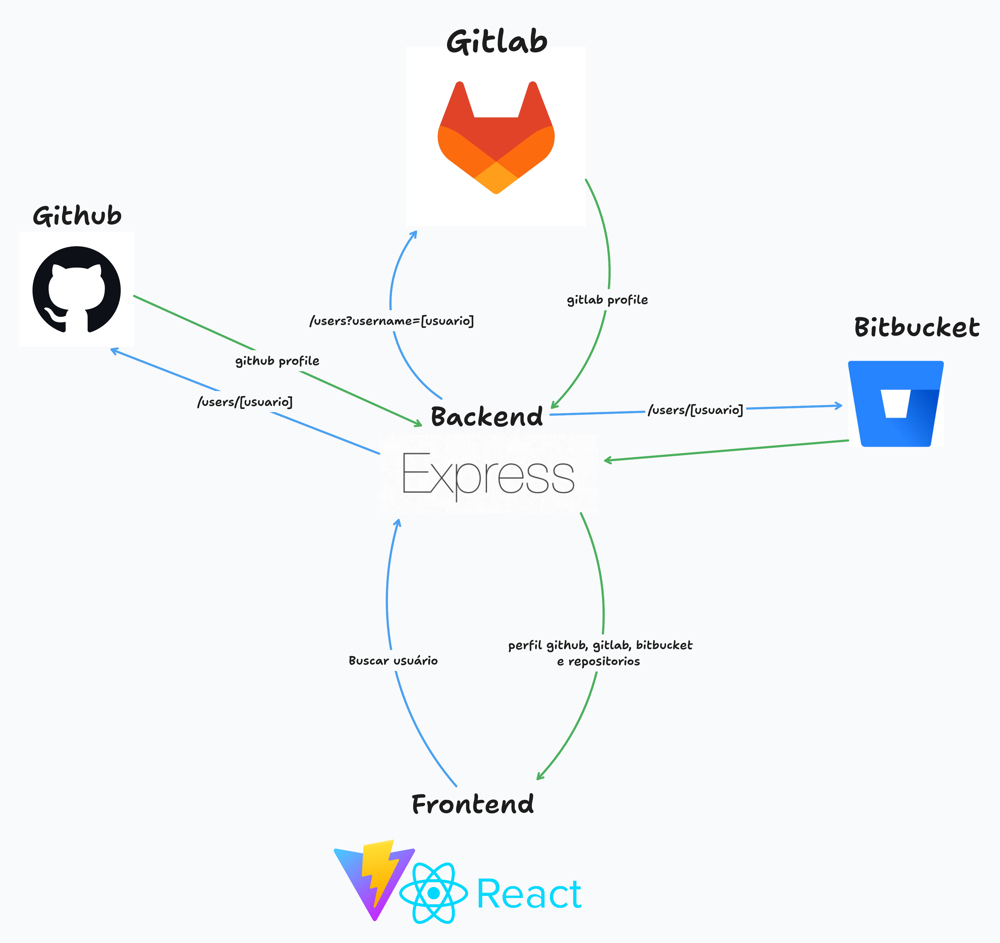

# GitFind: Seu Agregador de Perfis de Desenvolvedor


O GitFind é uma ferramenta poderosa projetada para centralizar a busca por perfis de desenvolvedores nas plataformas mais populares: **GitHub, GitLab e Bitbucket**. Com uma interface limpa e reativa, você pode facilmente encontrar informações de perfil, repositórios e atividades recentes de qualquer usuário em um único lugar.

## ✨ Funcionalidades

* **Busca Unificada:** Pesquise por nome de usuário simultaneamente no GitHub, GitLab e Bitbucket.
* **Perfil Detalhado:** Visualize informações essenciais do perfil, como nome, bio, localização e links sociais.
* **Lista de Repositórios:** Navegue pelos repositórios públicos do usuário.
* **Análise de Atividades:** Veja um resumo das contribuições e atividades recentes.
* **Interface Moderna:** Frontend construído com a versão mais recente do React (v19) para uma experiência de usuário fluida e dinâmica.

## 🛠️ Arquitetura do Projeto

O projeto é construído sobre uma arquitetura simples.


### 1. Frontend
* Desenvolvido com **React 19**.
* Responsável por toda a interface do usuário e experiência de navegação.
* Consome os dados da API Principal para exibir as informações dos perfis.

### 2. API Principal (Backend)
* Atua como um gateway, lidando com as requisições.
* Recebe as solicitações de busca do frontend.
* Comunica-se com as APIs de terceiros (GitHub, GitLab, Bitbucket) para coletar os dados.
* Agrega e formata os dados antes de enviá-los de volta ao cliente.

### 3. APIs Externas
* Utiliza as APIs públicas e oficiais do **GitHub**, **GitLab** e **Bitbucket** como fontes de dados.


## 🌐 Endpoints da API

A API Principal expõe os seguintes endpoints para consumo do frontend. Todos os endpoints são prefixados pela URL base definida no frontend (ex: `http://localhost:5000`).

| Método | Endpoint | Descrição |
| :--- | :--- | :--- |
| `GET` | `/search?username=[nome_do_usuario]` | **Busca Unificada:** Retorna um objeto agregado com dados do perfil do usuário no GitHub, GitLab e Bitbucket. |


## 🚀 Começando

Para executar este projeto localmente, siga os passos abaixo.

### Pré-requisitos

* Node.js (v22 ou superior)
* npm
* Git

## Como rodar

### 1. Clonar o Repositório

Primeiro, clone este repositório para a sua máquina local:

```bash
git clone [https://github.com/seu-usuario/gitfind.git](https://github.com/thethoomm/gitfind.git)
cd gitfind
```

### 2. Configurar o Backend (API Principal)

O backend é responsável por buscar os dados das APIs do GitHub, GitLab e Bitbucket.

```bash
# Navegue até a pasta da API
cd api

# Instale as dependências
npm install

# Crie um arquivo de variáveis de ambiente .env na raiz da pasta 'api'
# Pode ser necessário adicionar variáveis, consulto no .env.example
# Exemplo:
# PORTT=porta_da_api

# Inicie o servidor de desenvolvimento da API
npm start
```

### 3. Configurar o Frontend

Com o backend rodando, configure e inicie a interface do usuário.

```bash
# Em um novo terminal, navegue até a pasta do frontend
# Se estiver no gitfind/api, use cd ../app
cd app

# Instale as dependências
npm install

# Crie um arquivo .env na raiz da pasta 'app' para definir a URL da sua API
# Exemplo:
# VITE_GITFIND_API_URL=http://localhost:5000

# Inicie a aplicação React
npm run build
npm run preview
```


## 👨‍💻 Equipe

Este projeto foi concebido e desenvolvido por:

* **Carlos Eduardo Galvão** - [GitHub](https://github.com/Caduhhw)
* **Pedro Henrique Silva** - [GitHub](https://github.com/PedroMarqus)
* **Thomas Henrique Santos** - [GitHub](https://github.com/thethoomm)
